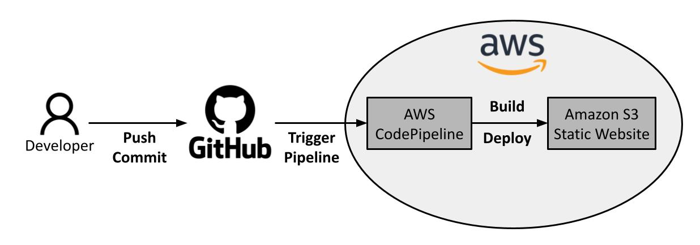

# CI/CD Pipeline for a Static Website to Amazon S3

- Continuous integration and continuous deployment for a static website to an existing bucket in Amazon Simple Storage Service (Amazon S3). 

- The static website is built using the [Hugo framework](https://gohugo.io/) and the [vncnt theme](https://github.com/fncnt/vncnt-hugo).

- The pipeline automatically starts when new changes are commited to the source code on GitHub, then the building and deployment process is triggered in AWS CodePipeline. The changes are reflected in the Amazon S3 bucket.

## License

This project is licensed under the MIT License. See the LICENSE file.

